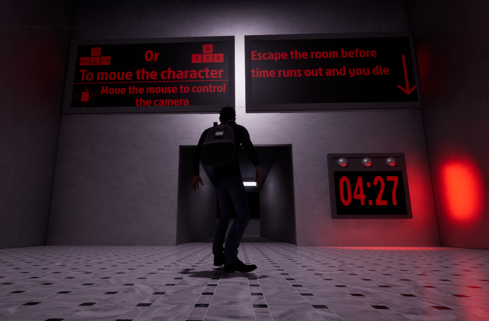

# Escape room 3D platform game.
My project is an Escape room 3D platform game. The idea is that you

## Core features
- Block pushing
- Almost completly diegetic UI (Means it's in the level itself and **no traditional HUD**)

## Things you should know about this current build
As this is just a MVP there are a few minor bugs and things you should know about it.

## How to link an image:

