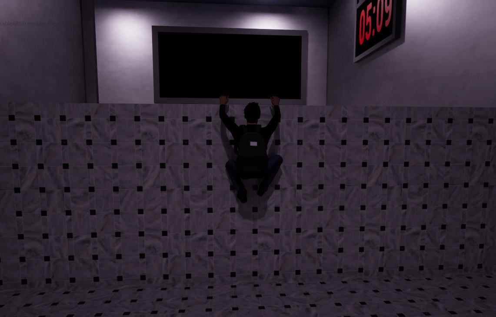
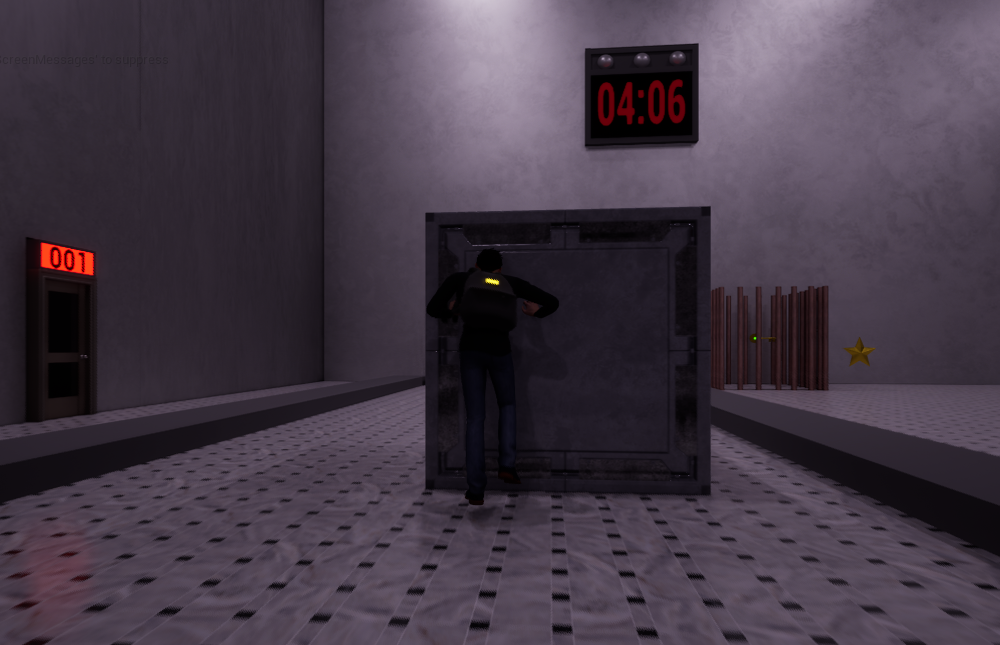
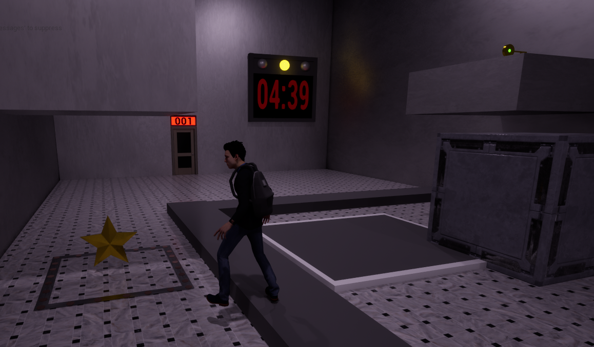
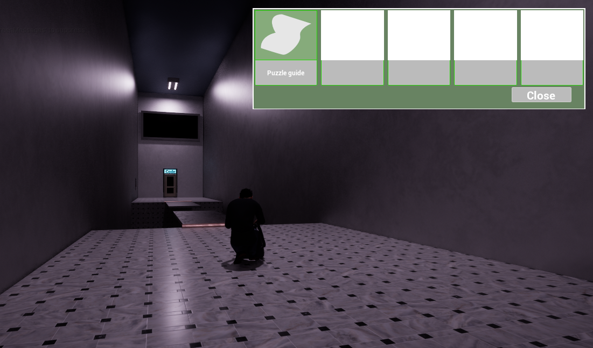
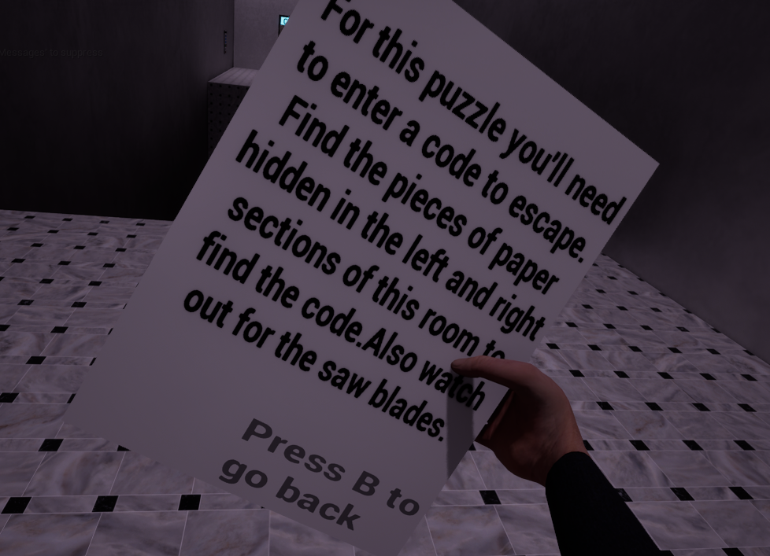
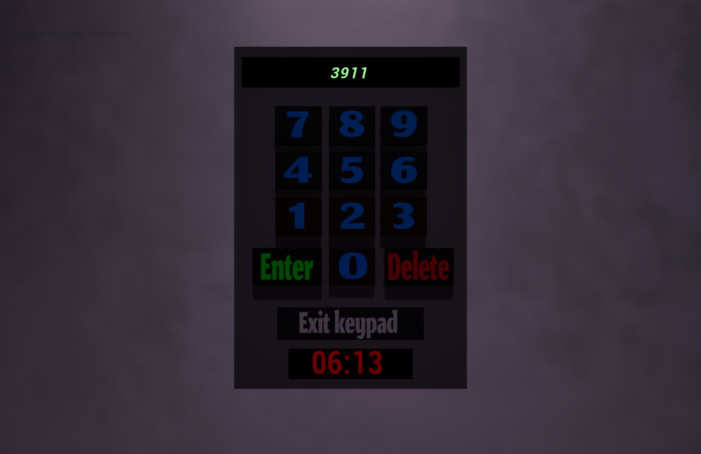
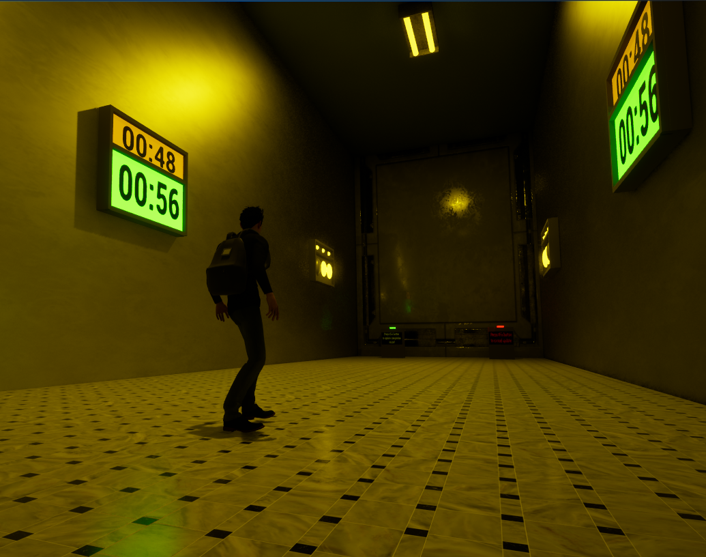

# Escape room 3D platform game.
My project is an Escape room 3D platform game. The idea is that you go through various rooms and solve puzzle/platformer challenges in order to escape, and while your at it, you can also try to find the 3 stars hidden in the levels. Most levels require you to find and collect keys to unlock the exit, while others require you to collect paper to get clues to a code you need to enter to unlock the exit. The game is designed to be replayable as your pushed to finish each level as fast as you can and improve your record completion time, and the record stars you collected.

## Core features
- Block pushing
- Can grab and climb up ledges
- Grounded and realistic feeling movement mechanics
- Almost completly diegetic UI (Means it's in the level itself and **no traditional HUD**)
- An intense atmosphere
- Inventory and looking at paper system (**Note:** Opening the inventory to look at the items you have is the only truly non-diegetic UI as of this build)
- Tracks and records your record completion and stars collected
- The option to choose a male or female character
- Accesibility options

## How this project was developed:
- This project was developed in Unreal Engine 5 (Initially 5.5.4, then later updated to 5.7.4)
- Was coded using the blueprint development methodology
- Character models and animations were imported from [Mixamo](https://www.mixamo.com/#/)
- Sound effects were downloaded from [Pixabay](https://pixabay.com/)
- Various assets assets and textures were imported from [Fab](https://www.fab.com/)
- The UI/buttons for the main and pause menu were developed and imported from [Figma](https://www.figma.com/design/lvtI4KNCJAmEmX7DtD71i0/Creating-Buttons?node-id=0-1&t=9jMFo2Cei2CKfRiH-1)

## Games that were inspiration for my project
- The Portal series
- The Prince of Persia Sands of Time trilogy
- The Oddworld series
- The Team Ico game trilogy (Ico, Shadow Of the Collosus and The Last Guardian)

## Key Bindings
- Use the **WASD** or **arrow keys** to move the player
- Press **The Space bar** to jump, jump at ledges to grab and hang from them
- **While hanging from a ledge:** Press **The Space bar** to pull yourself up, and press **S** or **the down arrow key** to drop down
- **Move the mouse** to steer the camera
- Press (Or sometimes hold) The **left mouse button** to interact with/pick up items **when the light on the players back is on**
- Press the **right mouse button** to recenter the camera behind the player
- Press **P** to pause the game
- Press **I** to open inventory then click a button to equipd/look at that item. Press **B** when looking at an item to put it away

## Things you should know about this current build
As this is just a MVP there are a few minor bugs and things you should know about it. All thing that would be fixed/reworked in future updates:
- When entering a code at keypads, you need to **double click** each button for it to work as of this build
- There are currently only 7 levels
- When climbing ledges the camera and glitch into the player a little
- Opening the inventory **(Pressing I)** only works when the player isn't near something they can interact with **(When the light on they're back is turned off)**
- If you open your inventoru when against and facing a wall, the player will clip into it, this is fixed by just closing out of the inventory, so just make sure your away from a wall when doing so
- Alot of people seem to struggle with level 6, so heres the solution to get the code: Papers A and B give you the first and second half of the code and you need to combine the last and first number respectvly. Example: if paper A and B Read "123.." and "..345", then the code is 12345

## In game screenshots:

